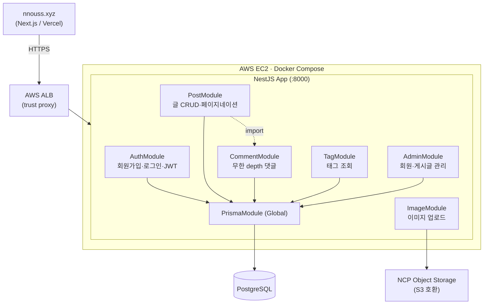
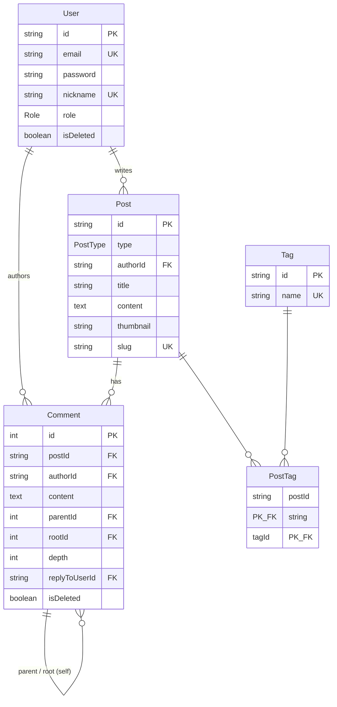
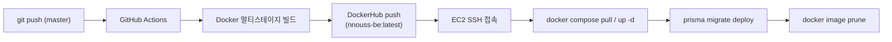

# nnouss-log-be

[nnouss.xyz](https://nnouss.xyz) 개인 기술/일상 블로그의 백엔드 API 서버입니다.

NestJS 기반의 모듈러 아키텍처로 인증, 게시글, 무한 depth 댓글, 태그, 이미지 업로드, 관리자 기능을 제공합니다. Prisma 7의 driver adapter를 사용해 PostgreSQL과 통신하며, 이미지는 네이버 클라우드 플랫폼(NCP) Object Storage(S3 호환)에 저장합니다. Docker 멀티스테이지 빌드 → DockerHub → GitHub Actions → AWS EC2로 이어지는 CD 파이프라인을 갖추고 있습니다.

> 프론트엔드는 별도 저장소(`nnouss-blog-fe`, Vercel 배포)에서 운영됩니다.

---

## 목차

- [기술 스택](#기술-스택)
- [아키텍처](#아키텍처)
- [데이터 모델 (ERD)](#데이터-모델-erd)
- [도메인 설계 노트](#도메인-설계-노트)
- [API 개요](#api-개요)
- [인증 & 인가](#인증--인가)
- [프로젝트 구조](#프로젝트-구조)
- [로컬 실행](#로컬-실행)
- [환경 변수](#환경-변수)
- [배포 (CI/CD)](#배포-cicd)

---

## 기술 스택

| 영역 | 사용 기술 |
| --- | --- |
| 런타임 / 언어 | Node.js 20, TypeScript 5 |
| 프레임워크 | NestJS 10 (Express 플랫폼) |
| ORM / DB | Prisma 7 (`prisma-client` generator + `@prisma/adapter-pg` driver adapter), PostgreSQL |
| 인증 | JWT (`@nestjs/jwt`, Passport `passport-jwt`), bcrypt |
| 검증 | class-validator, class-transformer (글로벌 `ValidationPipe`) |
| 파일 스토리지 | NCP Object Storage (AWS S3 SDK 호환), sharp(썸네일 리사이즈) |
| 유틸 | slugify, date-fns |
| 인프라 | Docker (멀티스테이지), GitHub Actions, AWS EC2, AWS ALB |

## 아키텍처

NestJS의 모듈 단위로 도메인을 분리한 레이어드 구조입니다. `PrismaModule`은 `@Global()`로 등록되어 모든 도메인 모듈에서 주입받아 사용합니다.



### 설계 포인트

- **모듈러 모놀리식** — 도메인별 모듈(Auth/Post/Comment/Tag/Image/Admin)로 책임을 분리하고, `Controller → Service → PrismaService` 레이어를 일관되게 유지합니다.
- **트랜잭션 기반 정합성** — 게시글 생성·수정·삭제 시 태그 생성/연결/정리(orphan 태그 GC)를 `prisma.$transaction`으로 원자적으로 처리합니다.
- **리버스 프록시 인지** — AWS ALB 뒤에서 동작하므로 `trust proxy`를 설정하고, ALB의 URL 이중 인코딩으로 인한 slug 조회 실패를 `decodeURIComponent` 폴백으로 보정합니다.
- **타임존 고정** — 프로세스 레벨에서 `TZ=Asia/Seoul`을 강제해 서버 환경과 무관하게 일관된 시간을 보장합니다.

## 데이터 모델 (ERD)



- **User** — `role`(ADMIN/USER)과 `isDeleted`(soft delete) 보유. 탈퇴해도 작성 댓글은 유지됩니다(`onDelete: SetNull`).
- **Post** — `type`으로 `dev`(개발)·`story`(일상) 게시판을 구분. `slug`는 URL 식별자(unique)이며 작성 시각 + slugify 제목으로 생성됩니다.
- **Tag / PostTag** — 게시글과 태그의 M:N 조인. 어떤 글에서도 참조되지 않는 태그는 트랜잭션 안에서 자동 삭제됩니다.
- **Comment** — `parent`/`root` 셀프 릴레이션으로 무한 depth 스레드를 표현합니다.

## 도메인 설계 노트

### 댓글 스레드 (무한 depth)

댓글은 셀프 릴레이션으로 트리를 구성합니다.

- `parentId` — 직계 부모 (`onDelete: Restrict`, 실수로 인한 연쇄 삭제 방지)
- `rootId` — 스레드 최상위 댓글 id. 조회 시 root 댓글을 페이지네이션한 뒤, 해당 root에 속한 자식들을 한 번에 가져와 `thread`로 묶습니다(N+1 회피).
- `depth` — 0=최상위, 1=대댓글, 2=대대댓글…
- `replyToUserId` — 2단계 이상에서 `@닉네임` 멘션 표시용

**삭제 정책** — 자식이 없는 leaf 댓글은 **hard delete**, 자식이 있으면 내용만 지우는 **soft delete**(`isDeleted=true`)로 처리해 스레드 구조가 깨지지 않게 합니다.

### 이미지 업로드

- 에디터 본문 이미지와 썸네일을 분리 처리합니다.
- 썸네일은 sharp로 **16:9 비율(최대 1280×720)** 로 `cover` 크롭/리사이즈합니다(원본이 더 작으면 원본 유지).
- 저장소는 S3 SDK(`@aws-sdk/client-s3`)로 NCP Object Storage에 업로드하고, 공개 URL을 반환합니다.

## API 개요

기본 포트: `8000`. `*` 표시는 JWT 인증 필요, `**` 표시는 ADMIN 권한 필요입니다.

### Auth (`/auth`)

| Method | Path | 설명 |
| --- | --- | --- |
| GET | `/auth/check-email?email=` | 이메일 중복 확인 |
| GET | `/auth/check-nickname?nickname=` | 닉네임 중복 확인 |
| POST | `/auth/sign-up` | 회원가입 |
| POST | `/auth/sign-in` | 로그인 (accessToken 발급) |

### Post (`/post`)

| Method | Path | 설명 |
| --- | --- | --- |
| GET | `/post?page=&tag=&type=` | 게시글 목록 (5개 단위 페이지네이션) |
| GET | `/post/latest?type=` | 메인 슬라이드용 최신 글 5개 |
| GET | `/post/all` | 사이트맵용 전체 slug 목록(dev) |
| GET | `/post/:slug` | 게시글 상세 |
| POST | `/post` * | 게시글 작성 |
| PUT | `/post/:id` * | 게시글 수정 (작성자 본인) |
| DELETE | `/post/:id` * | 게시글 삭제 (작성자 본인) |
| POST | `/post/:postId/comment` * | 댓글/대댓글 작성 |
| GET | `/post/:postId/comments?page=` | 댓글 목록 (스레드 묶음) |

### Comment (`/comment`)

| Method | Path | 설명 |
| --- | --- | --- |
| PUT | `/comment/:id` * | 댓글 수정 (작성자 본인) |
| DELETE | `/comment/:id` * | 댓글 삭제 (leaf=hard, 자식 존재=soft) |

### Tag (`/tag`)

| Method | Path | 설명 |
| --- | --- | --- |
| GET | `/tag?type=` | 태그 목록 + 타입별 게시글 수 |

### Image (`/image`)

| Method | Path | 설명 |
| --- | --- | --- |
| POST | `/image/upload` * | 에디터 본문 이미지 업로드 (`image`) |
| POST | `/image/thumbnail/upload` * | 썸네일 업로드 (`thumbnail`, 16:9 변환) |

### Admin (`/admin`) — ADMIN 전용 **

| Method | Path | 설명 |
| --- | --- | --- |
| GET | `/admin/users?page=&search=` | 회원 목록 (닉네임 검색) |
| PATCH | `/admin/users/:id/role` | 회원 역할 변경 (본인 제외) |
| DELETE | `/admin/users/:id` | 회원 비활성화 (soft delete) |
| GET | `/admin/posts?page=&search=&type=` | 게시글 목록 (제목 검색·타입 필터) |
| DELETE | `/admin/posts` | 게시글 일괄 삭제 |

## 인증 & 인가

- **JWT(Bearer)** — 로그인 시 `{ sub, nickname, role }` 페이로드로 토큰을 발급합니다(만료 `1d`).
- **`JwtAuthGuard`** — Passport `jwt` 전략 기반. `Authorization: Bearer <token>` 헤더를 검증하고 페이로드를 `req.user`에 주입합니다.
- **`RolesGuard` + `@Roles(Role.ADMIN)`** — 관리자 라우트에 역할 기반 접근 제어를 적용합니다.
- **비밀번호** — bcrypt(saltRounds 10)로 해싱하며, 회원가입 시 8~16자/영문·숫자 포함 정책을 검증합니다.
- **소유권 검증** — 게시글·댓글 수정/삭제는 서비스 레이어에서 작성자 본인 여부를 확인합니다.

## 프로젝트 구조

```
src/
├── main.ts                  # 부트스트랩 (CORS, ValidationPipe, trust proxy, TZ)
├── app.module.ts            # 루트 모듈
├── _config/                 # JWT / S3(NCP) 설정 팩토리
├── auth/                    # 회원가입·로그인, JWT 전략·가드
├── post/                    # 게시글 CRUD, slug, 트랜잭션 태그 처리
├── comment/                 # 무한 depth 댓글, soft/hard delete
├── tag/                     # 태그 조회
├── image/                   # NCP Object Storage 업로드 (sharp)
├── admin/                   # 회원·게시글 관리 (RolesGuard)
├── common/                  # roles 데코레이터·가드
├── prisma/                  # PrismaService (Global), driver adapter
├── utils/                   # 비밀번호 해싱, slug 생성
├── types/                   # Express Request 타입 확장
└── generated/prisma/        # Prisma Client 생성물

prisma/
├── schema.prisma            # 데이터 모델
└── migrations/              # 마이그레이션
```

## 로컬 실행

### 사전 요구사항

- Node.js 20+
- PostgreSQL
- (이미지 업로드 테스트 시) NCP Object Storage 자격 증명

### 설치 & 실행

```bash
# 1. 의존성 설치
npm install

# 2. 환경 변수 설정 (아래 표 참고)
cp .env.example .env   # 직접 .env 작성

# 3. Prisma Client 생성 & 마이그레이션 적용
npx prisma generate
npx prisma migrate dev

# 4. 개발 서버 (watch 모드)
npm run start:dev
```

서버는 `http://localhost:8000` 에서 동작합니다.

### 주요 스크립트

| 명령 | 설명 |
| --- | --- |
| `npm run start:dev` | watch 모드 개발 서버 |
| `npm run build` | 프로덕션 빌드 (`dist/`) |
| `npm run start:prod` | 빌드 결과 실행 |
| `npm run lint` | ESLint 검사·수정 |
| `npm run test` | 유닛 테스트 (Jest) |

## 환경 변수

| 변수 | 설명 |
| --- | --- |
| `DATABASE_URL` | PostgreSQL 연결 문자열 |
| `JWT_SECRET` | JWT 서명 시크릿 |
| `NCP_ENDPOINT` | NCP Object Storage 엔드포인트 |
| `NCP_REGION` | 리전 |
| `NCP_ACCESS_KEY` | 액세스 키 |
| `NCP_SECRET_KEY` | 시크릿 키 |
| `NCP_BUCKET` | 버킷 이름 |

> CORS 허용 오리진은 `src/main.ts`에 하드코딩되어 있습니다 (`localhost:3000`, `nnouss.xyz`, `www.nnouss.xyz`, Vercel 프리뷰).

## 배포 (CI/CD)

`master` 브랜치 push를 트리거로 GitHub Actions가 빌드부터 배포까지 자동화합니다.



### Dockerfile (멀티스테이지)

빌드 캐시와 최종 이미지 크기를 분리하기 위해 3단계로 구성합니다.

1. **builder** — 전체 의존성 설치 → `prisma generate` → `nest build`
2. **prod-deps** — `--omit=dev`로 프로덕션 의존성만 설치 → `prisma generate`
3. **runner** (`node:20-slim`) — `libvips`(sharp 런타임) 설치 후 빌드 산출물과 prod 의존성만 복사. 포트 `8000` 노출.

### 운영 환경

- **AWS EC2** + Docker Compose로 컨테이너 운영
- **AWS ALB** 뒤에서 HTTPS 종단 처리 (`trust proxy` 설정)
- 배포 시점에 `prisma migrate deploy`로 스키마 마이그레이션 자동 반영
```
